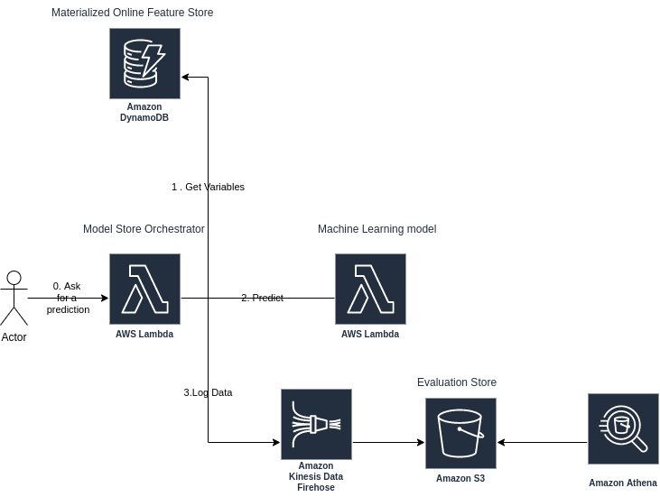

# Addi Challenge
The current repository contains infrastructure as code, deployment, and application logic to serve a very simple machine learning architecture composed of a feature + model + evaluation store.


## Challenge steps:
1. Train model and save in a model.joblib file in  https://github.com/RomuloSilvaRosa/addi_challenge/blob/main/lambdas/model_trainning/Trainning.ipynb
2. Deploy infrastructure (`./infrastructure`) using `scripts/CI.sh -a`
3. Deploy applications (`.lambdas`) using `scripts/CD.sh -a`


## Usage
To deploy all the stack
```shell
bash scripts/up_infra.sh
```

To clean the stack
```shell
bash scripts/clean.sh
```


## Project Structure
```
.
├── docs
│   └── images
├── infrastructure
│   ├── evaluation_store_main.tf # Evaluation Store Infrastructure
│   ├── feature_store_dynamo.tf # Dynamo Feature Store Infrastructure
│   ├── Makefile # Logic to deploy infrastructure
│   ├── model_store_model.tf # Model Store Machine learning Model Infrastructure
│   ├── model_store_orchestrator.tf # Model Store Orchestrator Infrastructure
│   └── provider.tf # Provider configurations
├── lambdas
│   ├── model_orchestrator # Model Store Orchestrator lambda to serve it
│   └── model_trainning # Model Store Machine learning Model trainning procedure and lambda to serve it
├── README.md
└── scripts # scripts to handle to deploy and destroy infra
    ├── CD.sh
    ├── CI.sh
    ├── clean.sh
    ├── evaluation_store.sql
    ├── python
    └── up_infra.sh
```
## Proposed Architecture (v0)
The architecture is compounded of 4 elements: 
1. A DynamoDB acting as an in-memory feature store;
2. A Lambda (model) serving the machine learning model trainned in https://github.com/RomuloSilvaRosa/addi_challenge/blob/main/lambdas/model_trainning/Trainning.ipynb
3. A Kinesis Firehose + S3 + Athena acting as an evaluation store;
4. A Lambda (orchestrator) acting as a glue between feature gathering, model prediction and logging data in evaluation store.



### Proposed Architecture (v1)
A v1 architecture should:
1. Monitor model performance;
2. Alarm in real time any undesired model condition;
3. Retrain model from Evaluation Store. Evaluation Stores seem to be more confident as feature sources than Feature Stores (because Evaluation Stores features are an exact copy of production features);
4. Having an API Gateway in front of Lambda orchestrator for caching and security purposes.


### Challenge Improvements

- [ ] Use variables in Terraform instead of hard coded names (for lambdas, ecr, etc)
- [ ] Convert Trainning.ipynb into an executable .py file
- [ ] Improve documentation (infrastructure and lambdas README.md)
- [ ] Improve documentation (lambda python documentation)
- [ ] Add unit tests
- [ ] Change Kinesis Firehose/Athena data format to Parquet or Orc
- [ ] Create CI/CD to different stages (sand/dev/prd)
